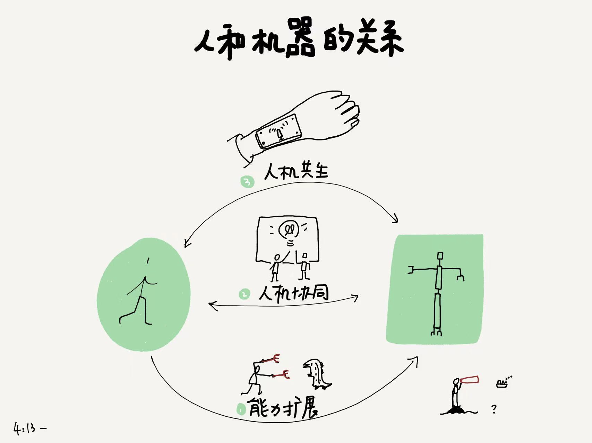
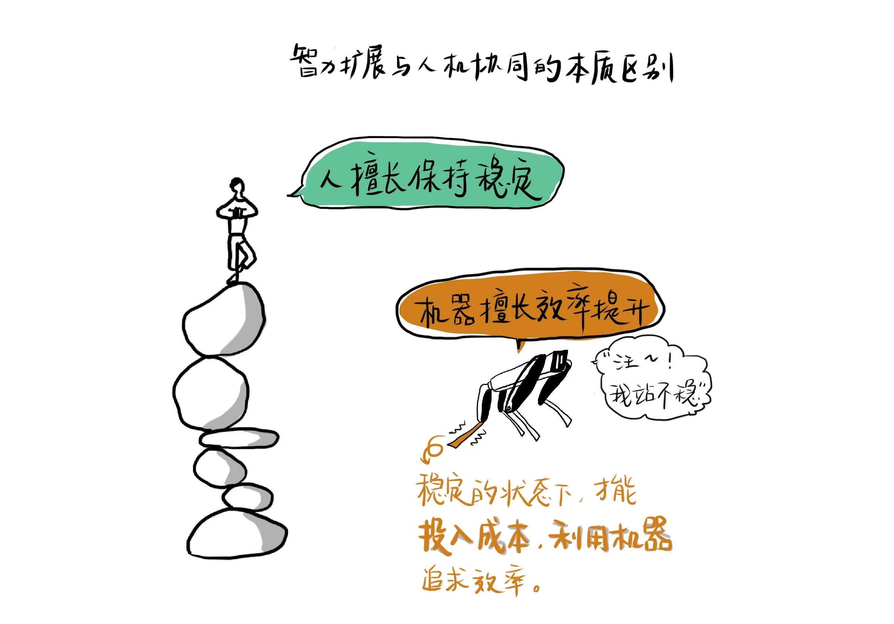
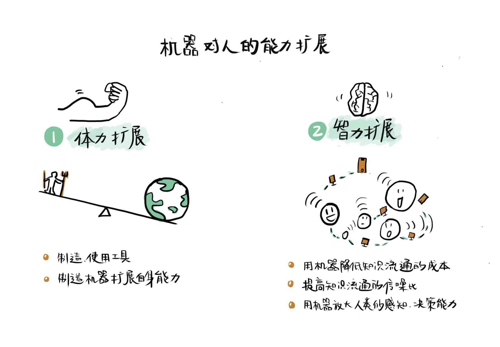
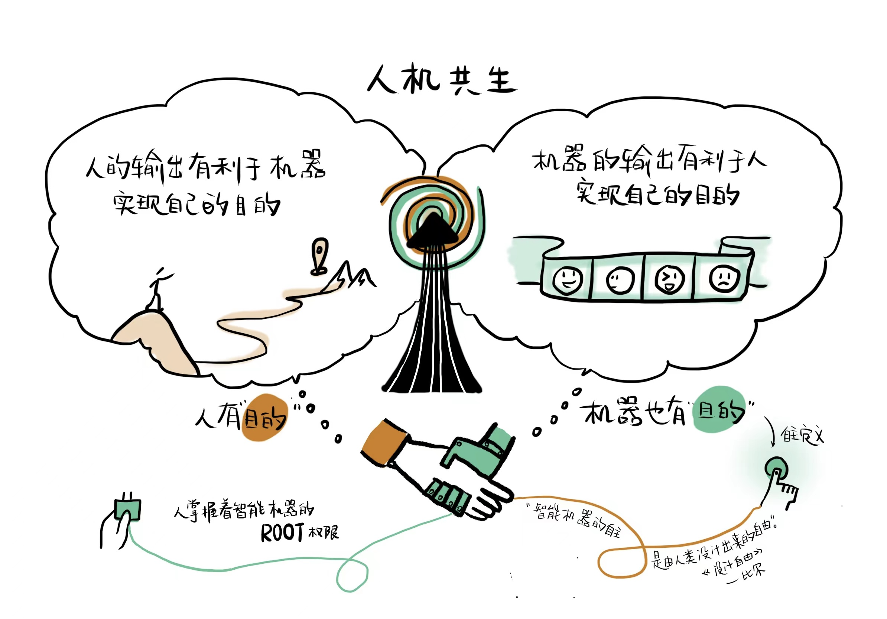
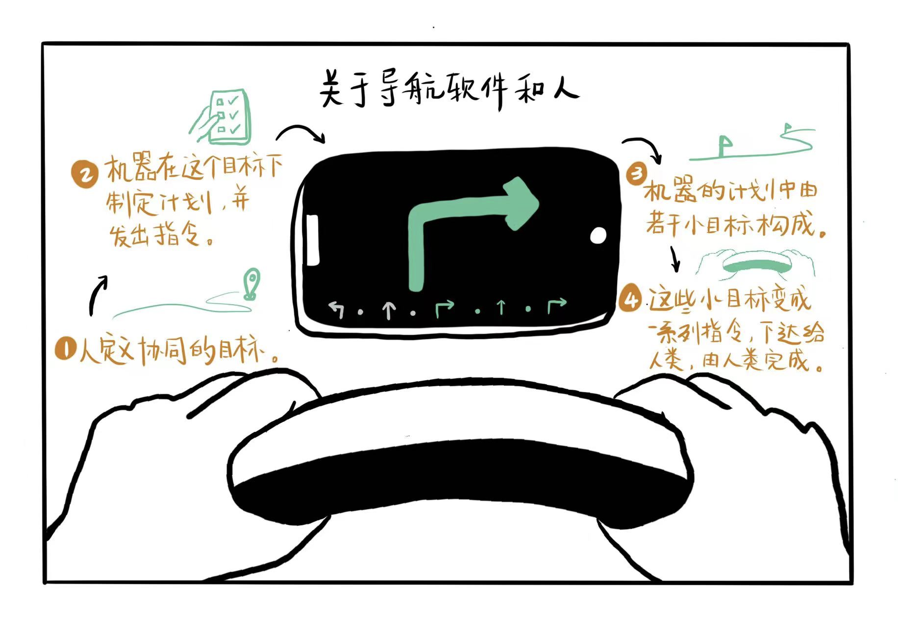

## 从何谈起

听到太多耸人听闻的机器取代人话题，及其变种：哪些职业不会被AI取代、哪些职业会被AI取代……与其在这些话题的裹挟下焦虑或者摆烂，不如我们好好来理清楚一下未来人和机器会存在哪些关系，个人通过人和机器的关系来看清楚自己在其中的位置，企业通过人和机器的关系来看清楚如何决定研发投入，如何保持与消费者的有质量关系。

人在地球上，为了实现一些目的，不得不要克服自身的局限，不得不面对越来越复杂的情况，不得不做出很多取舍。于是发展出越来越高级的工具——机器来，这些机器发展的势头如此迅猛，这些机器的发展方向如此日新月异，直到AI这个想法出现和实现，机器单纯的工具属性就不是那么明确了，于是在媒体的渲染下，开始导向另一个极端：机器会不会统治人类？《黑客帝国》那样的情景会不会到来？

我们必须回到实际情况来看事实，看本质。就算从另一个极端观点“机器统治人类”出发思考，我们也不能回避的就是我们如何和机器共处？关系如何建立？关系有哪些类型？思考这些问题，从日常现象出发思考这些问题，并且希望思考能够尽量触及本质：人的本质、机器的本质、人“创造”机器的动机和结果。

以上是撰写本文的出发点。

## 两种阶级

问题总是由人来定义的，优秀的人善于定义问题，而没有定义问题的机器，机器是求解问题的好手。人不但比机器善于定义问题，而且人在选择定义什么问题的时候就赋予了问题的意义，这一点机器永远望尘莫及。

人是一个复杂的生命系统，内在具有超高秩序，以负熵为食，单项输出的行为不确定，但是系统级别却稳定。没有一个确定的输入输出映射变换。人是复杂系统，有无法解释的特有现象——意识，因此才能主宰着这个世界上所有问题的定义权，绝对核心的权利，让科学和技术随着人类的意志而发展。

计算机，特指冯诺依曼结构的计算机，是一个确定性的机器，只要初始状态一样，得到的输出就是一样的，哪怕是计算机产生的随机数，也是伪随机数。相比人类，机器永远处于从属地位，因为机器是无法夺取定义问题的权利的。就算是在人类中，掌握了定义问题能力和权力的人就是处于食物链顶端的人。

地球上最笼统区分阶级，有一种二分法就是：“目的”阶级和“方法”阶级。目的是所有价值的流向处，方法是所有价值流向的工具。人和机器，机器永远属于方法阶级，而人是目的阶级。价值的最终流向不会是机器，肯定是人。

如果机器可以制造机器，那么机器会不会成为目的阶级呢？比如电脑病毒，它可以复制自身，似乎它是目的阶级。但我们想想，第一个电脑病毒是怎么产生的，它是由人制造出来的，目的存在于制造它的人那里，而不是这个病毒身上，而这个病毒的复制只是作为一个方法阶级在复制，而无法复制目的，因为目的不在它那里。

在公司里，老板们通常是目的阶级，打工人是方法阶级，老板们“要”，下属们“造”。打工人们身处方法阶级，也执着于和热衷于学习各种方法，持续提升自己的专业技能，期待在“方法”阶级中一路上行，保持竞争力。然而，方法阶级和目的阶级之间存在一道鸿沟，难以逾越。因为目的阶级掌握着定义问题的权力，方法为问题服务，定义问题的人有权力选择方法，持有方法的人却没有权力选择问题。

方法阶级是熵小的那部分，充满秩序的那部分，本身来说，是否能使得熵减也是对方法是否有效的检验尺度。目的阶级是熵大的那部分，是充满混沌的那部分，是时间之矢射向的地方。尽管如此，目的阶级掌握着问题定义权力的同时也掌握着方法评判的权力，因为他们处在时间之矢射向的一方，所以目的阶级通常是站在未来的。

作为方法阶级的机器，本身是一种变换，它的内在机制能将初始状态变换为新的状态，这是一种确定性，过程是一种熵减，如果变换得到新的状态符合目的，结果也是熵减，也就是负熵。作为目的阶级的人类，本身也是一种变换，与机器不同的是，人是生命系统，属于复杂系统，非线性不可预测和蝴蝶效应是复杂系统的两个特点。人作为一个生命系统，需要输入负熵才能维持自身运转，因此和人结合的机器要符合人的目的，这样机器变换得到的状态才是人类的负熵。

人和机器，人是目的阶级，机器是方法阶级，人掌握问题定义的权力和评判的权力，机器和人处在相同的环境下，面对同样的环境变量。根据机器的智能程度不同，人和机器的关系可以分为扩展、协同、共生三种。

这里所谓的机器智能程度，本质上是人类要让机器理解多少他自己的目的。如果完全不用理解人自身的目的，那么机器仅仅是扩展人的能力，主要还是依靠人来发号施令和采取行动，例如交通工具，这种我们称之为机器扩展人能力。如果人类把目的（或者部分）用数学形式表达出来在机器中得以实现，然后机器将输出结果给人做进一步决策处理，那么人和机器的关系就是协同关系，比如今天AI为人类决策提供辅助的机器，都属于人和机器协同工作，协同是一种广泛存在的人机关系，他们共同存在一个问题域中，一起实现一个人类的明确目的，这个目的是一个短期的、可测量的单一目的。最高级的形式是人和机器共生，人的终极目的——生存和发展依赖机器得以达到，机器为了帮助人实现终极目的，也需要从人类获取持续的负熵，机器可能也具有了广义的生存和发展目的。

人擅长保持稳定，直立行走的难度在于要把这么大一个身体用两只脚稳定，况且在此基础上还发展出了各种高难度的体育运动，人的智能就体现在此。波士顿狗，特斯拉人形机器人……等机器人，需要非常复杂的系统来达到使它稳定的目的，而这对于人来说易如反掌。人生病，往往是因为局部失去稳定，例如精神类疾病是大脑神经网络震荡，感冒是呼吸系统失去稳定，感染病毒是免疫系统失去稳定，癌症是细胞分裂失去稳定……

而机器擅长效率提升，人从原始社会开始制造工具，工具（原始机器）就是为效率而生的。单位量的投入，获得更多的产出。同样的力气投入，能撬动更大的物体，今天是同样的时间资本投入，能去更远的地方，能看更远的地方，能看更微小的物体和细节。

人保持稳定的天赋，仿佛是给世间一切设定了一个锚点，稳定的状态就是支撑其他一切的锚点。稳定的状态下，才能投入成本利用机器追求效率。如果人类追求效率，最终会臣服于机器，被机器奴役，如果人类追求稳定，那么机器的效率会臣服于人类。

## 能力扩展
机器对人的能力扩展，分为两个阶段：体力扩展和智力扩展。人作为一个地球上的智慧生命，在能量转换的链条上曾作为一个重要的hub节点存在，人将太阳能转化为化学能，然后再转换为机械能。随着人类对机器的发展，各种能够直接承担能量转换高效节点的机器层出不穷，逐渐代替了人作为能量转换节点的功能。人吃饱饭干农活，赶远路，现在都有机器完成，人吃太多能量反而多余成为脂肪堆积体内，需要额外消耗才行。机器扩展人的体能以工业革命之后达到顶峰。

人天生会制造和使用工具，用工具来突破身体的极限是一种天性，这也是广义的技术本质。从狩猎时的弓箭和标枪，到农耕时的锄头和牛车，到工业时代的机器，人不断用制造机器来扩展自身能力。其中工业革命之后，这种用机器扩展身体能力的进程进入奇点，人并不是必须成为太阳能到各种能量转化的必然节点了。

人从身体力行开始转向利用信息做更多事，例如改进生产关系，改进原来的生产流程。这一切都叫做能力扩展进入智能放大（Intelligence Amplification）阶段。这一切以互联网诞生为标志，机器对人类作用不再仅仅是扩展体力，而是可以放大智力。

互联网是一个巨大的机器，是很多单个的计算机用相同的通信协议互联在一起表现出的系统性。互联网对人的智力放大作用，就来自于这是人类有史以来最便捷获取知识的时代，造纸和印刷发明之前，掌握了书籍的人就垄断了政权，虽然在中国古代，官职从来不是世袭，但书籍可以世袭，因为抄写成本很高，知识共享几乎不可能，智力放大无从谈起，知识成为一种特权。

互联网允许人和人都可以低廉便捷获取任意地方、任意时间、任意人创造的任意知识。这对于学习能力好只缺知识来源的人，简直是福音。为什么互联网能对人类的智力进行放大？首先还是因为人和人之间存在智力方差，这里所说的智力主要是认知和知识，并不是智商。用技术手段将不同认知水瓶的人连接在一起，认知处在低水平的人就可以无差别获得高水平人的部分或者全部知识，于是人类就有一种智力趋于相同的趋势（仅仅是趋势）。

互联网对全人类的智力放大，给了我们在各个垂直行业很多启示。如果想要对一个行业、或者一个公司的员工的认知能力进行放大，那么想办法把他们互联起来就非常关键。同时互联网还给我们一个警惕，由于知识无差别流通，去中心化的机制会导致非知识、甚至是噪声也会得到放大，所以设计一种信噪比较高的互联通道就显得十分必要。最初去中心化的互联网如今在各个国家已经演化，不再是绝对的去中心化，各个国家都依靠政府的力量改进了互联通道，以降低噪声、提高信噪比。关于通过互联来进行智力放大，后面我们专门详细讨论，尤其是在服务业中。

智力放大除了用机器降低知识流通的成本和提高知识流通通道的信噪比，还有用机器放大人类的感知、决策能力。尤其是感知类AI算法在深度学习之后大爆发，语音识别和图像识别都可以媲美人类，所以眼睛和耳朵的部分感知任务可以交给机器，从而机器可以帮助人在决策时获得更多更及时的环境信息，这也是放大了人的智力。

## 人机协同

人机协同阶段，已然把机器当成一个比较重要的合作伙伴来看待，而不是一个简单的工具。协同意味着合作，合作意味着尊重另一方的输出。也意味着在共同目标下的妥协和取舍。人机协同阶段，相比能力放大阶段，最本质的区别就是人不能无视机器输出的信息，人也会给机器输入信息以期望机器下次输出更高质量的信息。

此外，不同于能力放大阶段，仅仅考虑人的短期收益，用机器来辅佐人快速达到短期收益最大化。人机协同，还考虑人的长期收益，这个长期收益，也就是未来贴现。为了使人在未来也获得收益，于是前沿要向机器做一些妥协。

两个系统耦合，是要有一个系统的输出作为另一个系统的参数的。人是一个复杂系统（输入多，且无法预测输出），机器是一个确定系统。机器的输出作为人的参数，或者人的输出作为机器的参数。

人需要结构化思维，从而才能参数化，从而才能接收机器的输出。机器的输入一定是结构化的。

最近参加公司的干部大会，董事长在台上讲到的话，有两个让我印象深刻。其中一个是问题，另一个是建议。

他提了一个问题：我们公司未来，做业务的如何与搞专业的人拧成一股绳？所谓做业务的，其实就是在真实的市场里实际产生经济收益的人，有的是销售，有的是提供直接服务获取利益。所谓搞专业的人，就是这些把高等教育所学专业延展到工作中继续耕耘的人。这两拨人长期依赖存在不可调和的矛盾，搞业务的人对搞专业的人，要么奉若神明，要么嗤之以鼻。奉若神明的人，大概还是对专业技能的帮助抱有一线希望，同时也并不懂专业，因敬佩和希望从而产生迷信。对专业的人奉若神明，特别容易把专业的人捧杀，因为专业上产生价值一般符合一个指数曲线，一开始还不如老办法，但是长期投入后会有翻天覆地的变化，而且这还取决于是不是投入得正确。如果有居心不良，沽名钓誉的专业人士，就很容易利用业务的奉若神明大肆捞取个人利益，一旦败露，就跑路到另一个行业或者公司，继续故技重施，这也利用了行业和行业之间信息不对称。对搞专业的人嗤之以鼻，大概率是受过专业人士“伤害”的人，或者是对自己过往经验和办法非常自信的人。

其实我们董事长这个问题，就是再问：人和机器如何很好协同起来？做业务的人通常相信人定胜天，而专业服务的人通常期望打磨出更高效率的机器来。进一步说来，做业务的人大概属于目的阶级，搞专业的人大概属于方法阶级。在一个靠搞业务的人奠定基础的公司，好处是目的明确，坏处是过去为了达到目的，沉疴的方法也不少，甚至原来的目的也已经过时，需要提出新的目的。做业务的人，其竞争力来自独一无二的宝贵经验，搞专业的人的竞争力来自一些经过检验（大概率不是该业务场景下检验）的框架、模型、流程、工具等。

假如说一个送信的邮差是搞业务的，当他还在汉朝时，他提出想要更快的马，这就是目的，如何驯马、养马就是与之匹配的专业知识。然而在工业革命之后，邮差再提出这个问题，回答问题的人就不应该是养马驯马的专业人士，而是汽车工程师，因为邮差的目的不再是“快马”，而是“快”。这里面谁能意识到马夫不再是需要的专业人呢？首先应该是邮差自己，他应该关注时代，知道时代的总体技术进步，汽车已经取代马成为更好的代步工具；其次是汽车工程师，他需要了解到汽车这个专业核心输出的价值是“速率”，那世界上对“速率”有要求的业务可能存在哪里，需要有时时刻刻的意识。

从邮差和马的协同，到邮差和汽车的协同。不变的是“更快把信送达到收信人手中”，邮差这边对应的变化有：

1. 需要掌握的技能从骑马到驾车；
2. 需要对马提要求到对车提要求；
3. 需要知道收信的人很快会感受到速度差异，从而提出更高的要求；
4. 需要好奇以后取代汽车送信方式的会是什么？新的目的是什么？还是送信快的交通工具吗？

今晚重新看昨晚写的邮差这一段，实在是大错特错。这个例子不是人机协同的例子，而是不同的能力扩展的例子。原因在前文已经阐述过了：人机开始协同，一定是人类已经开始重视机器的输出了，并且还会反过来给机器输入一些它不知道的（哪怕以受限的方式）。显然邮差不会重视马或者汽车的输出，因为它没有对邮差有什么输出。为什么？这有涉及到人机协同会出现在什么场景下的讨论了。人机协同会出现在决策场景下，人和机器会合作，是源于人想要获得一个高质量的决策，所以他会理性地不拒绝一个可能正确的参考意见，如果这个参考意见持续值得重视，那么人还会有意识想要进一步提高它。

决策场景才会有人机协同出现，这意味着人机协同必须要有一个属性就是：存在协同目的，是人机协同的前提。人机协同，其实是提高了机器的地位，将机器从方法阶级往目的阶级拉了一步，但是人和机器在这个协同关系里，还是人说了算，人是目的的掌控者、修改者、定义者和评判者，机器只能随着人掌控的目的而变。

沿着这个话题展开下去，有两个问题我需要回答：

1. 什么样的机器才能和人协同呢？
2. 协同的方式有哪些呢？

关于什么样的机器能和人协同，我想先从上面失败的邮差例子说起。直觉上，汽车和马都不能作为邮差的协同机器。为什么呢？因为汽车和马不能被邮差的目的所迭代，也就是他们不能自动尝试缩短他们和邮差目的之间的距离或误差。邮差希望更快点，马不能变成汽车，马甚至都不能测量出它当前的速度来，汽车虽然能感知到自己当前的速度，但是汽车不能根据邮差期望的速度和汽车当前速度差距自动调节，以达到邮差的目的。

具体回答这两个问题，我想放到后面的专门章节给出。

## 人机共生

人机协同阶段开始于人对机器输出的重视，这时候机器已经开始脱离纯粹工具属性。试想一下，有两种下属，一种下属是纯粹执行角色，那么leader和这样的下属是不存在协同的，相反，当某个下属的意见和建议开始被leader重视之后，协同开始了。

那么人机协同之后的阶段是什么呢？就来到人机共生。互相离不开称之为共生。在协同阶段，人和机器有一个共同目的，这个目的来自人的定义。共生阶段，可能有多个目的，人有人的目的，机器有机器的目的，两个不同可以不同，但是一定要能相融。并且在实现自己目的的过程中，人的输出有利于机器实现自己的目的，机器的输出也有利于人实现自己的目的。

读者请注意，当机器和“目的”挂上钩，来到目的阶级，那么机器一定具有智能了。又如果机器的目的还是独立于人的目的，那么这个智能一定不再是我们今天看到的智能形式。今天看到的人工智能，还智能存在于人机协同关系下，毕竟今天的人工智能都是在冯诺依曼计算机模式下实现的，必须有预先定义的问题和程序，哪怕是学习型程序，也逃不脱这个预先定义的天花板。人机共生阶段，智能机器的目的，应该是它自己“定义”的，这里的“定义”强调一种主动性和自由意志，和我们所说的哲学定义或者数学定义不一定是一个意思。

具有自主性的智能机器，其存在的目的还要和人类的目的相融，这是我们给出的人机共生的一个方向性思考。除此之外，出于对“人是一切的目的”的信仰，我还必须为人机共生增加一些约束条件：

1. 智能机器的“自主”，是人类设计出来的自由（见比尔《设计自由》），而不是完全自主生长出来的自由。
2. 智能机器的root权限还是在人手中。

对于人机共生阶段是一个什么画面，我现在还是模糊的，以及我们提前应该做一些什么准备，才能更有利于人类未来，我也是模糊的，不过我愿意慢慢思考和探讨。

## 从AirPods想到的

晚上骑着共享单车去打球，戴着AirPods听歌，我在想：这一对耳机，和我的耳机如此贴合，而且我越来越依赖它，那它算不算跟我共生了呢？这个耳机里送来的美妙音乐，来自这个世界上曾经或者现在某个音乐家，他们创作这个作品，有很多人演奏了，又有人使之变成字节，流动到了此刻我的耳朵里。这一对耳机，并不是增强了我的能力，它给我输入了一个信号，它在我这个系统所处的环境中增加了一个信号源。毫无疑问，这一个信号源输入到我的神经网络中，改变了我的神经网络的运行，也许长期下去，还能改变我的神经网络结构，比如我长期听古典音乐后我思考问题的方式就肯定不同于我长期听抖音神曲之后，我相信能改变神经网络结构。

但问题是，我的耳机依赖我吗？如果它不依赖我，那么还算不上共生。机器被发明制造出来的，如果也考虑它的存在（being）如何定义的话，那么一定是被人使用才算存在。如果机器被制造出来，没有被人使用。那么它就死亡了。这不是一个比喻，这是一个哲学视角，同时也是一个商业视角。所以当我的AirPods被我使用时，它survive了，它不被人使用，它死亡了。从这个意义上，我和AirPods属于哲学上的人机共生。

## 谈谈特斯拉机器人

特斯拉发布了人形机器人“擎天柱”，据马斯克自己的说法是：制造人形机器人的初衷是为了提高全民可支配收入，想用机器人来解决劳动力不足的问题。创造人形机器人的目的是：为人类创建世界；友善；消除危险、重复、无聊的任务。面对埃隆·马斯克这个狂人的宏大蓝图，我在思考的问题是：为什么机器人一定是人形的呢？“是否人形”这个特征的是或者否，各自选择了人机关系的什么未来呢？

作为人类，的确有很多工作我们希望摆脱，危险的、枯燥的、无意义重复的工作等。这些摆脱的工作交给谁呢？显然利用经济手段或者制度手段交给另外一拨人都不是美好的，和奴隶制度无异。如果交给其他物种，大概会好受一些，例如动物，但是最完美的是交给没有生命的物种，也就是机器，这样才完美解决“人不愿意做的工作”和“人不应该奴役人或其他生命”这一对矛盾。

总结来说：

1. 人需要自身之外的某种存在（being）完成那些工作，或者是其他人、其他生命、其他物种。
2. 人最希望看到的是其他无生命物种来完成那些自身不愿意做的工作。

所以我认为，机器人“是否人形”的结论应该是：机器人是什么形状都行，但一定不应该是人形。

人和机器的关系，主要取决于，在人眼中，机器是什么。而另一个问题则更微妙：在机器眼中，人是什么。这个问题似乎不用机器来回答，依然是由人来回答，并且答案最终会表现在机器的实现上。

在人眼中，机器是什么？是低价值工作的承接者，是紧贴中心的边缘角色，是不参与人类伦理构建的物体。如果说马斯克吧机器人设计成人形，仅仅是为了让人类和机器一工作的时候更舒适，那完全错了，人只有和平等的伙伴一起工作才会舒适，权力大于自己，或者小于自己的，长久下去都不舒适。

特斯拉人形机器人，大概率只是一种营销手段，而非技术蓝图。如果是蓝图，会失败的。因为人形完全没必要。

## 谈谈扫地机器人和智能音箱

扫地机器人进入寻常百姓家，智能音箱也飞入千家万户。扫地机器人和智能音箱的确是帮助家庭成员承担了一些人类不愿意承担的工作，那么它们和人类的关系是什么呢？会怎么发展呢？

扫地机器人和智能音箱并非扩展了人的能力，他们所做的事情完全在人的能力范围内，只是不在人的意愿范围内。有了扫地机器人，智能音箱，家庭会变得更好吗？不一定，家庭变得更好并不取决于这些“成员”。扫地机器人和智能音箱应该要分开来看，两者解决的问题价值不同。智能音箱并没有实际问题解决，只是创造了一种新的交互方式。扫地机器人是把低价值重复劳动——清洁室内交给了机器，并且还需要人类设定房间地图，清扫机器。这样来看，扫地机器人和人的关系更亲密一些，是和人类在协作，解决家庭清洁问题。

## 谈谈导航软件

现在我们开车习惯用导航软件，尤其是在不熟悉的地方开车，例如假期自驾游，我们基本上是被导航软件牵着鼻子走。导航让我们向左向右，我们遵令照办。这个时候，机器和人的关系是机器在主导，人在听取指令。第一次意识到这个问题的时候，我有了深深的恐惧，首先恐惧的是这个关系：机器在给我下指令；然后恐惧的是我竟然没意识到，绝大多数人都没有意识到，也没觉得有什么问题。但是我冷静想了一下，就释然了。导航软件为什么导航，为什么有各种指令，是因为我们给它设置了目的地，它在去往我们人类想要去往的目的地过程中，分解出了动作指令，需要我们人来配合完成。这是一个完美的人机协同例子，这个例子有以下要点：

1. 人定义协同的目标。（人依然是目的阶级）
2. 机器在这个目标下制定了计划，并发出指令。（机器为人的目的找到方法，机器是方法阶级）
3. 机器的计划中由若干小目标构成。（小目标内机器是目的阶级）
4. 这些小目标变成一系列指令，下达给人类，由人类完成。（人是小目标内的方法阶级）

