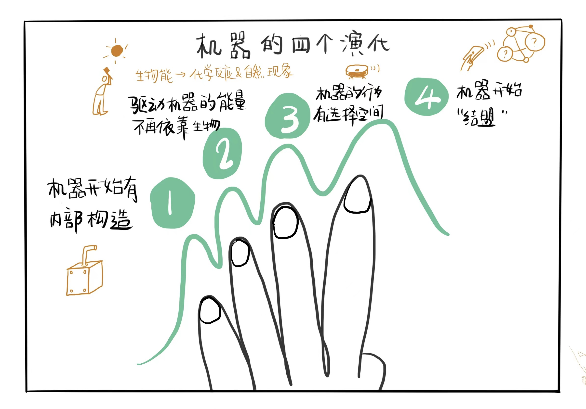

# 机器的四个演化

## 机因：决定机器的存在

机器是伴随人类科技进步而进步的，科技进步，机器的内在越丰富、多样、复杂，直至智能。从木棒、石斧等毫无内部构造，到今天全世界互相连接的计算机。驱动机器这样演化的“因”是什么？导致一台机器是石斧还是互联网的“因”是什么？我把这个“因”称之为“机因”。正如生物有基因，群体有模因，机器有机因。机因最初肯定源于人的制造目的。人想要劈开猎物的肉，是石斧的“机因”，人想要还击狼群的攻击，是木棒的机因，人想要和别人快速交流，是互联网的机因。

如何理解机因？

要回答这个问题，先回答：机因“表达”（借鉴基因最终表达出生命的说法）出的机器是什么样？决定一部机器A之所以是机器A，不是机器B是什么？决定一部机器A是机器，而不是人的是什么？是机因。因为机因的不同，所以表达出来的机器也不同。因为有机因，所以它表达出来的实物叫做机器，不是人，不是动植物。如果机因相同，那么就称之为克隆机器了。那到底机因是什么样子呢？从几个例子来看看机因到底是什么。从同一个生产线上同一批次先后紧接着下线的两辆汽车，他们应该具有相同的机因。但另一个问题出现了，同样方式生产的两台计算机，如果运行不同的软件时，他们是相同的机器吗？这个问题可以类比人，同样的一个人的躯壳，给他换上不同的意识，他还是原来的他吗？这两个问题，回答都应该是否定的。机器的内涵不止包含硬件，也包含软件，而且以软件为主要定义机器存在的因素。

机因取决于什么？它取决于创造者的制造目的和使用者的使用目的，人类的制造目的不同，机因不同，例如同一品牌不同款式的汽车，创造者的制造目的不同。使用目的不同也决定机因不同，是出于这样的直觉：同样一款汽车，两个人分别购买了，若干年以后，这两台汽车显然是不同的机器，因为这个过程中，两个使用者使用目的不同，给同样的机器赋予了不同的经历，经过了不同位置的维修和改装，原来出厂时的汽车设计方案，已经不能完全解释此时的汽车了。同样是两台iPhone14 pro，出厂时机因相同，但到了不同的用户手中，它们的机因就变化了，安装了不同的应用软件，用在了不同的场合。

机因的有什么构成？我认为是：设计方案及实际的输入历史。设计方案既有初始设计方案，也有后来的维修改造方案，设计方案一台机器静静在那里不工作的样子，它决定了机器的内部构造，决定了机器的能量使用方式，决定了机器的选择方式及消化数据的方式。同样的设计方案，可以表达出同样的机器。除了设计方案，机因还包括机器处理的所有输入。例如两台装有同样IOS版本的同样的iPhone 14 pro，出场时设计方案相同，所有此时机器相同，如果用户对手机A的App Store中输入了“微信”关键字，而在手机B的App Store中输入了“Whatsapp”关键字，那么完成安装后，两台机器已经不一样了，他们除了了两个不一样的实际输入。我们可以用最新的生物学理论来类比。研究表明，人类形态，除了受DNA遗传决定，还受社会文化决定，所谓“表观遗传学”，就是人类这台机器在现实运行中处理的实际输入，反作用于机器本身，重新塑造（有别于“创造”）了机器。

一言以蔽之，关于机因的三个基本假设：
1. 机因起源于人的设计目的；
2. 机因指导形成了机器的硬件和软件；
3. 机因由设计方案和实际输入构成。

机因，可以用于复制机器（遗传），也会在复制的过程中不可预期地出错（变异），也会经过演化而淘汰或存留（进化）。机因的进化表现为机器的进化，我把机器的进化划分为四个分水岭。这四个分水岭是依据机因表达的丰富程度来划分的。首先是从“实心”无零件的机器，到有零件的机器，然后是机器所需能量来源于生物到能量来源于别的机器，第三个分水岭是机器从毫无自主性，到有限自主性，分水岭就是机器内部是否存在选择空间，这一个阶段不好理解，后面详细描述，第四个分水岭就是开始以数据为食。

## 机器开始具有内部构造

首先的一个演化分水岭就是：机器开始有内部构造。

人类最初制造的机器，比如木棒，石斧等，都是把自然实物的外形根据需求重新塑造而来，这类工具的特点是没有内部构造，通俗的说就是没有零件，“实心”的。人类在原始阶段制造的机器，和动物没有特别区别，就地取材，为我所用，“组装”的想法并未成熟。虽然它们有自己的自然构造，但是人类在制造这些工具的时候，仅仅重塑了外形，而没有对内部重塑。

组装首先意味着抽象和总结，抽象并总结出可以复用的部分。例如锄头，铁的部分和木柄的部分，各有功能。铁的部分是经过抽象，总结成：和大地直接交锋就需要这样的形状和坚硬的材料，木柄部分是经过抽象，总结成：需要一定的长度以达到杠杆效果，也不需要坚硬的材料，更不应该增加额外的重量。

而抽象和总结有需要建立在大量的生产实践经验之上，抽象和总结本身也是人类的认知发展历程，所以人类一开始不可能有太多组装的工具。

随着人生生产实践增加，总结出来的“零件”越来越多，组装也成为一个常态。这类“机器”越来越少。可复用的零部件越来越多，人类制造的工具和机器越来越复杂，仅靠外形塑造的工具不满足日常生产活动。时至今日，仍然有少量原始的“实心”工具存在，例如擀面杖，陶瓷器。

如何解读第一个分水岭前的机器（其实只是单一的工具）的机因呢？这一分水岭的机因，承载了人类的单一目的，是人类和这个外部世界之间一层浅浅的分界线。人类在使用这一类机器时，常常是用来满足最原始的需求，例如吃、喝。常常人类不把这些承载单一原始目的的“实心”工具当作机器，他们在机器的群体中也是边缘的，但是并不能忽略他们是今天丰富机器族群的发源地。就像我们不能否认人和猴的关系。

组装机器所需要的单一零件，其实依然是“实心”的，或者成之外“不可再分”零件。零件的形状标准化、功能单一纯粹化，是组装机器发展的直接原因。尤其是，标准化“实心”零件是来自机器还是来自人，更决定了组装机器的速度。人们在抽象总结出单一功能的零件之后，如果还需要人的双手来制造出，那么组装机器的生长速度仍然取决于人的精力，例如锻造农具，制作织布机，雕刻印刷活字。相比之下，今天的手机，零部件的制造由机器制造，大部分组装也由机器完成，手机的生长速度就远远快于织布机。

不可再分的零件是机因的基本表达单位，和基因的DNA碱基功能等同。零件的表达能力越强，能组装出来的机器就越复杂。不可再分的“实心”零件越精细，他们就能组合出更多的可能性。例如印刷机器，不可再分的零件是一部书的雕刻，这个机器就只能印刷这部书，如果不可再分的零件是每一个汉字，那么就可以印出任何书，这就是活字印刷。

## 机器所需能量不再依赖生物

接下来进入第二个分水岭：驱动机器的能量不再依靠生物。

如果说“实心”的机器特别像是人类作为上帝的直接造物，那么第二个分水岭之后的机器则出现了人类利用机器制造机器，一些机器开始成为造物主。

机器需要能源驱动，能源主要是什么来源？来自生物、自然现象、化学反应、物理反应。长期以来，能源都是依靠生物，尤其是依靠人自身，比如农业中，使用锄头等工具的时候，依靠人的能量、牛马的能量驱动机器工作。这些生物成为太阳能的中转节点，通过食用食物获得能量，通过驱动机器工作消耗能量。

随着技术基本，生物作为能量中转节点不再必要，工业革命之后，能量来源主要是依靠化学反应和自然现象，化学反应如石油、煤，物理反应就是核聚变，自然现象如风、水、太阳。这些能量都比生物提供能量大得多，越大的能量，能驱动的机器内部构造越复杂，也越需要加以控制。

如今，无论是家庭中的扫地机器人，还有马路上飞驰的汽车，天空里呼啸的飞机，还有深空里肉眼不可见的哈勃望远镜和天宫空间站……这些机器，功能明确，每一个机器都有详细的设计图纸，也就是它有明确的内部构造，而且驱动能量都不是直接依靠生物。

## 机器开始具有自主选择的智能属性

第三个演化分水岭是：机器的行为开始有选择空间。

机器从开始不用生物驱动后，逐渐发展为无处不需要能量驱动。显然在脱离对生物输出能量的依赖之后，机器的演化趋势是内部构造变得越来越复杂。内部构造复杂化之后，机器要满足人类的目的，不一定需要动用其全部零件“组合”出来就可能达成目的。

电子计算机是内部构造极度复杂的机器，复杂在于集成电路，比如说一颗CPU上的微观结构，非常复杂。在定义的指令集驱动下，组合出千千万万的可能性来满足人类定义的目的，为了更方便组合，机器在硬件之外演化出了配套的软件，软件就是帮助组合内部无比复杂的硬件的。

演化出了软件的机器，长期以来还是需要人类定义如何组合。直到当机器不在直接接受人类定义的流程，而是存在一定自己选择的情况时，机器开始具有智能属性了。

机器是否开始具有“智能”的属性，本质上是机器在面对一个情况时，是否具有选择空间，而“没有选择空间”就是指：机器只能按照预先设定的动作执行，或者预先没有任何设定于是不工作。

启动洗衣快速模式洗衣，洗衣机于是开始按照既定流程完成，灌水，滚动，清洗、甩干，停止。洗衣机没有选择空间。
计算机开机，根据启动指令，自检，完成引导程序，然后启动操作系统，开始进入工作，等待输入。计算机（简单操作系统，不包含应用软件）没有选择空间。
这些没有选择空间的机器占据当今机器的主流，无论预先设定的程序多么精细、把各种程序的触发条件想得多么完整，满足条件之后机器接下来要做什么，都是没有选择空间的。

智能机器的出现，本质上就是出现了机器自主选择的情况，允许机器自主选择，首先得给机器定义选择空间，其次得赋予机器选择策略，这两个是机器是否“智能”的前提条件。这里必须澄清一下，现在消费电子市场里，“智能”是被严重滥用的，最大的滥用就是智能手机，智能手机本身是不智能的，相比所谓的功能手机，智能手机进步的是传感器更加丰富、输入体验更好（触摸输入为主）、输出方式更细腻（主要是屏幕更精细），以及应用软件更加多样（跟前三个原因密不可分）。加上网络通信发展（3G、4G、5G）更加丰富了应用软件的多样性。智能手机（不包含任何应用软件）原本也是没有选择空间的，但是随着应用丰富起来，机器有了自主选择的空间。

扫地机器人，在任何一个位置，它可以选择前进后退等，人类无法提前为所有情况预先设定要做什么，只能为机器预先定义它有哪些动作，并预先赋予一个选择策略，从而机器根据选择策略在不同情况下从赋予的选择空间中选择一个动作执行。

门户网站，就是没有选择空间的，用户访问时，呈现的内容是预定的。而个性化推荐内容app，则存在选择空间：从海量内容中选择少量呈现给用户。

## 机器开始结盟，并以数据为“食”

机器在体力上打败人类，始于机器不再从生物获取能量之后。机器从智力上打败人类，始于机器开始以数据为食。其实，以数据为食的机器，本质上是是利用“他人”知识，打败“本人”的。

AI发展历程里，从机器学习到深度学习，就经历了从人造特征到深度学习取代人造特征。传统机器学习为了让机器做出更好的选择，常常依赖人造特征，这时候，机器以某个人的知识为食。深度学习，机器广泛使用大量数据，训练出了各种瞠目结舌的应用，不论是下棋、还是识别语音人脸、机器翻译、作画等，都比大多数业余人类做得好，也是因为这个时候，机器食用的不再是少数人的知识，而是很多人的知识，机器联合起了其他机器，从而获得了被连接起来的人类产生的数据（包括知识）。

互联网使人类知识充分互相连接后形成的上限是机器智能的上限。机器在充分互联的知识基础上进化出全知全能似乎是一个NP难问题，除非量子计算机诞生让这个难题消失。正是机器开始“结盟”，即机器之间被连接在一起，才导致机器会挟“所有人”的知识超过“一个人”，也因此，机器和人的边界开始模糊。

贴身跟随我们的手机等3C产品，它的硬件部分，在本质上和马路上飞驰的汽车没有区别，也是精密设计的仪器。但如今的3C产品，更大的不一样是搭载了开放的操作系统，并利用了各种网络通信技术。其搭载的操作系统“孕育”了丰富的应用软件；其次，绝大多数应用，利用蓝牙、互联网和其他机器互相“连接”：交换数据，这种连接让小机器构成了一个无形的大机器。

单一机器互联成巨大机器，发生的最大变化在于：这个巨大机器的行为已经不可预测了。是一个巨大黑箱，其特性也符合复杂网路研究范围，会“涌现”出诸多新的模式。
